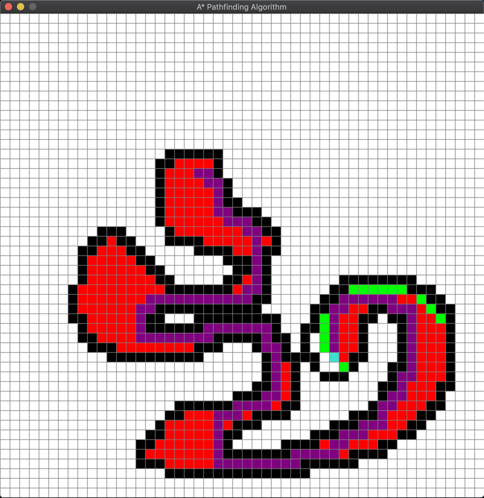

# AstarPathfinding

This is a visual implementation of the A* poathfinding algorithm that uses Python3 and pygame.

A* is an extension of Dijkstra's algorith with some characteristics on breadth-first search. A* algorithm introduces a heuristic into a regular graph-searching algorithm, essentially planning ahead at each step so a more optimal decision is made.

Uses a function that adds the cost of reaching the crrent node and an estimated cost to the goal.

f(n) = g(n) + h(n)

f(n) = total estimated cost of path through node 
g(n) = cost so far to reach node 
h(n) = estimated cost from n to goal. This is the heuristic part of the cost function, so it is like a guess.

The tool allows you to select a starting position(orange block), end position (turquoise block), and place barrier blocks (black blocks) in that order with left click. The user can then remove barrier blocks with right click if they want. Once the start and end positions have been placed the user can start the simulation by using the space bar. Once the simulation has ended the a purple line will appear showing you the most efficient route to reach the end position. After that the user can press 'c' to clear the grid and start again.

To run this program you will need Python3 and pygame installed

Below are two examples of the simulation completed

